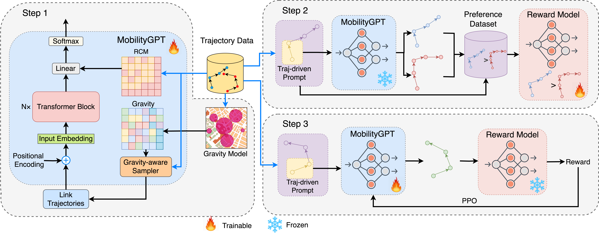

# MobilityGPT
  


**MobilityGPT** is a state-of-the-art model designed for **human mobility modeling**. Built as a **decoder-only GPT model**, it excels at generating mobility trajectories with high precision. By integrating **transformer architecture** with **spatial awareness**, MobilityGPT delivers superior trajectory predictions, making it a powerful tool for understanding and forecasting human movement patterns.

## Key Innovations
We introduce a **novel approach** to construct a **trajectory-aware preference dataset** for fine-tuning MobilityGPT with reinforcement learning, enabling the model to self-improve without the need for human labeling. This approach combines:
- Established fine-tuning strategies
- A new preference feedback dataset

By leveraging **self-supervised learning**, MobilityGPT minimizes human intervention, addressing scalability and bias challenges while continuously improving its performance.

### Key Features
- Road network awareness through adjacency matrices
- Gravity-based trajectory sampling
- LoRA (Low-Rank Adaptation) fine-tuning support
- Differential Privacy training options
- Multiple training approaches (Base, DPO, RLTF)

### Prerequisites
- Python 3.9+
- PyTorch 2.0+
- CUDA-capable GPU (recommended)

### Required Files
Your dataset directory (e.g., `SF-Taxi/`) should contain:
- `roadmap.geo`: Road segment geographical information
- `roadmap.rel`: Road segment connectivity information
- `Trajs_SF.txt`: Trajectory data file with comma-separated road segment IDs

## Installation

1. Create and activate a new virtual environment:
```bash
python -m venv mobilitygpt
source mobilitygpt/bin/activate 

pip install -e .
```

## Dataset

The project utilizes publicly available San Francisco Taxi dataset. We preprocessed and extracted map-matched trajectories. We follow the same data structure for all datasets (Porto and Beijing) and inspired from the [Ts-TrajGen](https://github.com/WenMellors/TS-TrajGen).

The dataset can be downloaded from  our [Drive](https://drive.google.com/drive/folders/1jgm3-joMt15zGIbXo85UUhm8rrf47Kc6?usp=sharing)

## Preprocessing


For creating the input data `Trajs_SF.txt` for the model, you can use the following command:
```bash
python preprocessing/input_MobilityGPT_data.py
```

For gravity-based sampling, you need to preprocess the data by generating the gravity-based sampling matrix.

```bash
python preprocessing/gravity_based_sampling.py
```


## Usage

### Pretraining

```bash
python main.py --dataset SF --mode pretrain
```

### SupervisedFine-tuning

```bash
python main.py --dataset SF --mode supervised --model-path model_pretrain
```

### DPO Training
```bash
python main.py --dataset SF --mode dpo --create-dpo-dataset --model-path model_supervised
```

### RLTF (PPO) Training

```bash
python mobilitygpt/train.py --dataset SF --mode ppo --create-rl-dataset --model-path model_supervised
```

## Configuration

### Main Parameters
- `dataset`: Dataset name (e.g., "SF")
- `validation_split`: Train/validation split ratio (default: 0.2)
- `eps`: Epsilon value for differential privacy

### Model Configuration
- `block_size`: Maximum trajectory length
- `learning_rate`: Training learning rate
- `lora_rank`: Rank for LoRA adaptation
- `lora_alpha`: Alpha value for LoRA
- `lora_dropout`: Dropout rate for LoRA

## Model Features

### Base Model
- Road segment-level GPT architecture
- Spatial awareness through adjacency matrices
- Gravity-based sampling support

### Training Options
- Standard training
- LoRA fine-tuning
- Differential Privacy
- RLTF fine-tuning
- DPO training


## Citation

If you find this code useful in your research, please consider citing:

```
@article{mobilitygpt,
  title={Mobilitygpt: Enhanced human mobility modeling with a gpt model},
  author={Haydari, Ammar and Chen, Dongjie and Lai, Zhengfeng and Zhang, Michael and Chuah, Chen-Nee},
  journal={arXiv preprint arXiv:2402.03264},
  year={2024}
}
```
